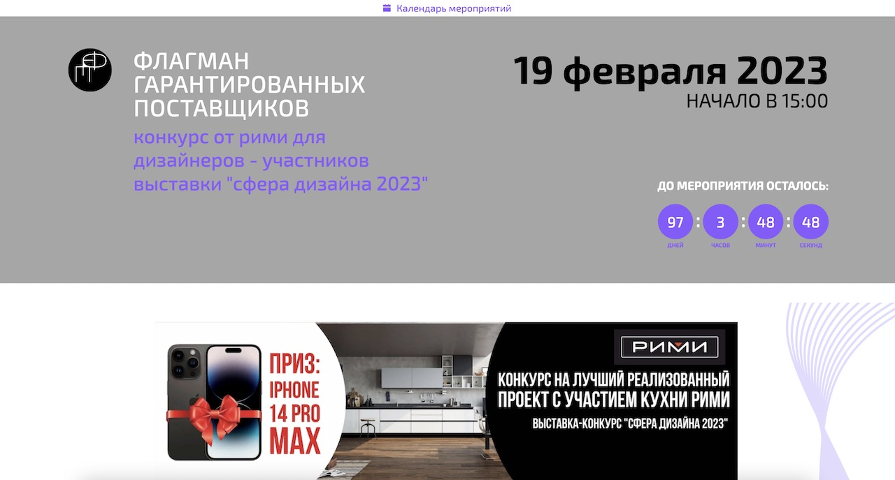

# fogapo.ru

This is a [Next.js](https://nextjs.org/) project bootstrapped with [`create-next-app`](https://github.com/vercel/next.js/tree/canary/packages/create-next-app) with CSR fetching JSON data from server via API.




1. To view a static site **[click here](https://fogapo.ru/)**.
2. To view a site's code **[visit repository](https://github.com/Starck43/fogapo.git)**.
3. To add/change content **[open Django](https://admin.fogapo.ru)**.


## Site code

Site was written on React/Next.js with Python/Django backend. Pages are pre-rendered at build time

 - `next-config.js` -  API settings
 - `core/constants.js` - to change additional personal data
 - `pages/*.js` - base pages
 - `components/*.js` - all component's folder
 - `public/` - folder for icons, logos and fonts
 - `babel.config.js` Babel settings

### babel.config.js configuration
```
module.exports = {
		"plugins": [
				[
						"babel-plugin-root-import"
				],
				[
						"styled-components",
						{
								"ssr": true
								"displayName": true,
								"preprocess": false
						}
				],
		]
}
```

### Online registration

For sending data on server it uses a fetch function with post method [Python API](https://admin.fogapo.ru/api/user/add).
After success data saving server sends email notifications to administrator and message author


## Backend

Based on Django framework API with Python code
 - `backend` -  Django project
 - `backend/forum` -  API app

 For creating API used `djangorestframework` package
 All packages saved in `backend/requirements.txt` file

```bash
# Environment installation
$ python3 -m venv venv
$ source ./venv/bin/activate

# Install main project to crm folder
$ django-admin startproject crm .
# Install new app to api folder
$ django-admin startapp api

$ python3 manage.py createsuperuser

$ pip install -r requirements.txt

$ python manage.py migrate
# collect static
$ python manage.py collectstatic
# run server
$ python manage.py runserver [localhost:8000]
````

### API endpoints
1. **[all posts    ](https://admin.fogapo.ru/api/posts/)**
2. **[detail post  ](https://admin.fogapo.ru/api/posts/[id]/)**
3. **[latest post  ](https://admin.fogapo.ru/api/post/latest/)**
4. **[add user data](https://admin.fogapo.ru/api/user/add/)**


## Frontend

Before working with the project you need to be installed Node.JS, Git and Yarn.
In terminal clone and run the project:

```bash
# Clone this repository to your project's folder
$ git clone https://github.com/Starck43/fogapo.git

# Go into the repository
$ cd fogapo

# Install dependencies
$ npm i (or yarn)

# Start development server
# npm run dev
$ yarn dev
```


## Deployment

When you are done with development you should commit changes and push them back to github.

### Deploy to Github

```bash
$ git add ./
$ git commit -m "some changes added"
$ git push origin
```

If you want to view a compiled site on github.io, please, read [Deploying on Github Pages](https://create-react-app.dev/docs/deployment/#github-pages) docs for React.

### Deploy on Vercel

The easiest way to deploy your Next.js app is to use the [Vercel Platform](https://vercel.com/new?utm_medium=default-template&filter=next.js&utm_source=create-next-app&utm_campaign=create-next-app-readme) from the creators of Next.js.

Check out our [Next.js deployment documentation](https://nextjs.org/docs/deployment) for more details.


## Technologies Used

- [React](https://reactjs.org/)
- [NextJS](https://nextjs.org/)
- [Bootstrap React](https://react-bootstrap.github.io/)
- [Django](https://docs.djangoproject.com/)
- [Vercel](https://vercel.com/docs/)

## Favicon Package

Generate favicons with [RealFaviconGenerator](https://realfavicongenerator.net/)

To install this package:

If the site is <code>http://www.example.com</code>, you should be able to access a file named <code>http://www.example.com/favicon.ico</code>.

*Optional* - Check your favicon with the [favicon checker](https://realfavicongenerator.net/favicon_checker)
